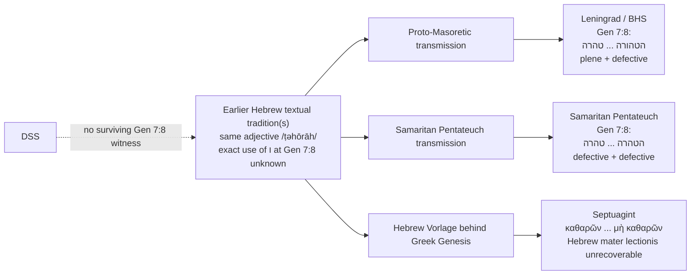

# Why Genesis 7:8 Has Both טהורה and טהרה for “Clean”

## Executive summary

The two forms in the Masoretic Text of Genesis 7:8—**הַטְּהוֹרָה** and **טְהֹרָה**—are **not two different Hebrew words, not two different grammatical endings, and not a case of one form carrying a pronominal suffix**. They are the same feminine-singular adjective, from **טָהוֹר** “clean, pure,” written once **plene** (“full”) with an internal **ו** marking /ō/ and once **defectively** without that mater lectionis. The only consonantal difference between **טהורה** and **טהרה** is the **internal ו**:

**טהורה** = ט־ה־**ו**־ר־ה  
**טהרה** = ט־ה־ר־ה

Both have exactly the same final **ה**, the normal feminine-singular **־ָה** ending. In the Tiberian reading tradition both are pronounced with /ō/: **טְהוֹרָה / טְהֹרָה**, approximately *ṭəhôrāh*. Gesenius explicitly describes **ו** as a vowel letter used for /ō, ū/ and stresses that Masoretic use of such matres is inconsistent, with numerous plene/defective alternations; he likewise identifies **־ָה** as the usual feminine-singular absolute ending. citeturn19view0turn18view0

Genesis 7:8 in the MT/BHS tradition reads:

> **מִן־הַבְּהֵמָה הַטְּהוֹרָה וּמִן־הַבְּהֵמָה אֲשֶׁר אֵינֶנָּה טְהֹרָה וּמִן־הָעֹוף וְכֹל אֲשֶׁר־רֹמֵשׂ עַל־הָאֲדָמָה׃**

Consonantally, therefore: **… הבהמה הטהורה … הבהמה אשר איננה טהרה …**. Digital representations sometimes attach the ḥolem Unicode mark to the preceding letter rather than visually to the ו, but the underlying consonantal distinction is unambiguous. citeturn3search2turn25search1

The strongest internal evidence is Genesis **7:2**, which has essentially the **same alternation in the same two syntactic positions**: definite attributive **הַטְּהוֹרָה** with ו versus predicative **טְהֹרָה** without ו. Genesis **8:20**, however, has a definite attributive feminine **הַטְּהֹרָה** written defectively, showing that the article or attributive syntax does **not** grammatically require the ו. citeturn27search1turn7search3

The Samaritan Pentateuch is especially informative. At Genesis 7:8 it has **הטהרה … טהרה**, omitting the ו in **both** places. Florentin and Tal's scholarly Samaritan edition explicitly contrasts Samaritan **הטהרה** with MT **הַטְּהוֹרָה**, while giving the Samaritan reading tradition approximately *aṭṭā̊ʾēra / ṭā̊ʾēra*. That is strong comparative evidence that the MT's internal ו is an **orthographic mater lectionis**, not a morpheme. citeturn5search4turn29search0

The Septuagint translates the relevant adjective with forms of **καθαρός**, e.g. **καθαρῶν … μὴ καθαρῶν**, preserving the semantic contrast “clean / not clean” but necessarily telling us nothing about whether its Hebrew Vorlage had an internal ו. Greek witnesses also display larger expansions/harmonizations involving clean and unclean birds at this point, but those are clause-level textual phenomena independent of the Hebrew plene/defective spelling. citeturn20search0turn20search25turn20search8

No extant Dead Sea Scroll biblical manuscript is known to preserve **Genesis 7:8 itself**, so there is no Second Temple Hebrew copy that can decide whether the local archetype had **הטהורה** or **הטהרה**. The published corpus of biblical Qumran Genesis fragments preserves other portions of Genesis, while the Israel Antiquities Authority archive confirms several fragmentary Genesis manuscripts; none supplies this locus. citeturn15search8turn28search17turn28search0

**Bottom line:** synchronically, the difference is **orthographic**; morphologically the forms are identical feminine-singular absolute adjectives. Between MT and the Samaritan Pentateuch it is technically also an **orthographic textual variant**. There is no good grammatical basis for treating **טהרה** in Genesis 7:8 as a noun “purity,” a construct form, or an adjective plus a 3fs pronominal suffix. The remaining uncertainty concerns only the **history of the spelling**—whether an early form had the ו and some traditions lost it, lacked it and the proto-MT gained it, or varied from an early stage.

## The textual witnesses

BHS is a diplomatic edition fundamentally reproducing the Masoretic text of Codex Leningradensis B19A rather than constructing an eclectic Hebrew text. The Deutsche Bibelgesellschaft identifies BHS as an edition of that Masoretic tradition, and the freely distributed SBL BHS text confirms the Hebrew text, although the openly available electronic files do not provide the complete proprietary critical apparatus. citeturn26search2turn26search0turn26search5

### Genesis 7:8 across the principal witnesses

| Witness / edition | Relevant wording | Vocalization / reading | Morphology of “clean” | What it can establish |
|---|---|---|---|---|
| **MT / Leningrad–BHS, first occurrence** | **הטהורה** | **הַטְּהוֹרָה**, *haṭṭəhôrāh* | adjective; **fem. sg.; absolute; definite; attributive; no suffix** | Plene spelling: ו writes /ō/. citeturn3search2turn25search1 |
| **MT / Leningrad–BHS, second occurrence** | **טהרה** | **טְהֹרָה**, *ṭəhôrāh* | adjective; **fem. sg.; absolute; predicative; no suffix** | Defective spelling: the same /ō/ is indicated by ḥolem without ו. citeturn3search2turn20search2 |
| **Samaritan Pentateuch, first occurrence** | **הטהרה** | Samaritan reading tradition approximately **aṭṭā̊ʾēra**; SP manuscripts do not use Tiberian pointing | adjective; fem. sg.; definite attributive; no suffix | SP lacks the internal ו where MT has it. citeturn5search4turn29search0 |
| **Samaritan Pentateuch, second occurrence** | **טהרה** | approximately **ṭā̊ʾēra** in Florentin–Tal's notation | adjective; fem. sg.; predicative; no suffix | Here SP and MT agree consonantally in defective spelling. citeturn5search4turn3search2 |
| **LXX, cattle/animals** | **τῶν κτηνῶν τῶν καθαρῶν … τῶν κτηνῶν τῶν μὴ καθαρῶν** in the expanded Greek tradition | *katharōn … mē katharōn* | Greek adjective, genitive plural neuter agreeing with **κτηνῶν** | Confirms the clean/not-clean semantic opposition, but Greek cannot witness a Hebrew ו used merely as mater lectionis. citeturn20search25turn20search0 |
| **Other LXX textual form** | **ἀπὸ τῶν πετεινῶν καὶ ἀπὸ τῶν κτηνῶν τῶν καθαρῶν … τῶν μὴ καθαρῶν …** | same Greek adjective | same | Shows variation within Greek transmission at clause level; still irrelevant to Hebrew plene/defective ו. citeturn20search8 |
| **DSS / Qumran biblical Genesis** | — | — | — | **No direct witness to Gen 7:8 survives**, so no DSS evidence can adjudicate the ו. citeturn15search8turn28search17 |

A methodological point is important here. The **LXX is a textual witness to wording and meaning**, but not normally to a Hebrew mater lectionis where the presence or absence of that letter makes no difference to pronunciation or translation. A translator hearing or reading either **טְהוֹרָה** spelling would render the same adjective. Thus one should not write “LXX supports טהורה” or “LXX supports טהרה” in this particular orthographic question; it supports only a Hebrew adjective meaning “clean.” The Greek tradition itself contains a larger variation concerning birds—some forms explicitly classify both clean and unclean birds—which belongs to the well-known harmonizing tendency discussed in scholarship on Greek Genesis. citeturn20search25turn28search21

The **Samaritan Pentateuch**, by contrast, is directly probative because it is Hebrew. Its **הטהרה … טהרה** demonstrates that a Hebrew textual tradition could write the same adjective defectively in both positions. Florentin and Tal's recent annotated edition calls attention specifically to this divergence from the MT at 7:2 and 7:8. citeturn5search4turn29search0

The absence of Genesis 7:8 among the DSS is worth emphasizing because it limits how confidently we can reconstruct the spelling's early history. The official IAA Leon Levy library identifies several 4Q Genesis copies, including manuscripts containing Genesis 1 and other scattered passages, while Tov's collected transcriptions show how discontinuous the surviving Genesis material is. There is consequently no manuscript from Qumran at this exact word against which to test MT or SP. citeturn28search0turn28search4turn28search17

## Morphology and Hebrew grammar

### What the two Masoretic forms actually are

The lexical adjective is **טָהוֹר** “clean, pure.” BDB expressly lists the feminine **טְהֹרָה** under this adjective and cites Genesis 7:2 and 7:8 among occurrences referring to ceremonially clean animals. This is decisive against interpreting consonantal **טהרה** here as a separate lexeme. citeturn31search11turn31search7

The two phrases parse as follows:

**מִן־הַבְּהֵמָה הַטְּהוֹרָה**  
“from the clean animal(s)”

Here **הַטְּהוֹרָה** is feminine singular because it agrees with feminine **בְּהֵמָה**. It is attributive, so both noun and adjective carry the definite article. Hebrew attributive adjectives agree with their head nouns in gender, number, and definiteness. citeturn19view1

**וּמִן־הַבְּהֵמָה אֲשֶׁר אֵינֶנָּה טְהֹרָה**  
“and from the animal which is not clean”

Here **טְהֹרָה** is again feminine singular, but it functions predicatively after **אֵינֶנָּה**, “it/she is not.” It therefore does not carry the article. The feminine agreement with **בְּהֵמָה** remains exactly the same; only the syntactic function changes.

That syntactic difference does **not**, however, explain the missing ו. Genesis 8:20 provides the control case: a definite attributive adjective can itself be written **הַטְּהֹרָה**, without ו. Thus “attributive = plene” and “predicative = defective” is not a Hebrew grammatical rule. citeturn7search3

### The ו is a mater lectionis

Classical Hebrew can indicate long vowels with consonantal letters used secondarily as **matres lectionis**. In this adjective, **ו** can represent /ō/:

**טְהוֹרָה** = plene/malé spelling  
**טְהֹרָה** = defective/ḥaser spelling

The Tiberian Masoretes point both with the same vowel quality. In the defective form, the ḥolem is attached directly to the preceding **ה**; in the plene form, the spelling contains **ו**, conventionally represented with ḥolem male. Gesenius's discussion of Hebrew vowel letters specifically notes the use of **ו** for /ō/ and /ū/ and stresses that the distribution of vowel letters in the received text is far from uniform. citeturn19view0

This kind of variation is pervasive enough that modern scholarship treats the chronology of plene spelling as a substantive historical problem. Joel Elitzur's recent study, “Plene Spelling and Defective Spelling in the Hebrew Bible: The Question of Dating,” explicitly addresses the debate between models in which matres were progressively introduced by later scribes and models in which substantial plene spelling can be quite early. His conclusions concern the system as a whole; they do **not** provide evidence for deciding the direction of change at Genesis 7:8 specifically. citeturn29search1turn29search8

### The final ה is not the variant

The most important orthographic observation can easily be missed:

> **ט ה ו ר ה**  
> **ט ה _ ר ה**

The variant letter is **ו**, not **ה**.

Both words terminate in **־רָה**, and in both the final **־ָה** marks the feminine singular. GKC describes feminine nouns and adjectives as historically associated with a feminine *-t* element but notes that the independent/absolute feminine singular is most commonly written **־ָה**, with final ה serving orthographically to indicate the long final vowel. citeturn18view0turn18view1

Consequently, **טְהֹרָה** does not mean “טהר + her,” nor is its final ה an extra possessive pronoun.

A genuine third-feminine-singular pronominal suffix has a different grammatical function: on nouns it means “her X,” and in Tiberian notation final consonantal ה can be distinguished by **mappiq**, conventionally **־ָהּ**. GKC's suffix paradigms explicitly show forms with consonantal final **הּ**. citeturn24search0turn24search5 The Genesis adjective has **־ָה**, without mappiq, and there is no possessor or object for a pronoun to represent.

Indeed, the overt feminine pronominal agreement in the second clause is already in **אֵינֶנָּה**, “she/it is not,” whose feminine singular reference is **הַבְּהֵמָה**. Nothing pronominal needs to be supplied on **טְהֹרָה**.

### Absolute versus construct

Both adjectives are **absolute**, not construct.

The first is a normal definite noun-plus-adjective phrase:

**הַבְּהֵמָה הַטְּהוֹרָה**

The second is a predicate:

**אֵינֶנָּה טְהֹרָה**

Neither is followed by a dependent genitive that would create a construct chain. GKC notes that attributive adjectives normally follow their noun with agreement, whereas true adjectival construct usages are comparatively restricted. citeturn19view1

The historical relationship between feminine **־ָה** and forms with **־ת** in construct contexts is therefore interesting Semitic morphology, but it has no role in explaining **טהורה : טהרה** here. Again, the difference is **inside the stem's spelling**, at the vowel /ō/, not in the feminine ending.

### Why consonantal טהרה can be misleading

There is a genuinely different Hebrew noun from the same root, conventionally vocalized **טָהֳרָה** and meaning “purity, cleansing.” Lexica distinguish that noun from adjective **טָהוֹר**. citeturn22search1turn31search11

Without vowels, therefore, the four consonants **טהרה** are potentially ambiguous in isolation. But Genesis 7:8 is not ambiguous:

**אֵינֶנָּה טְהֹרָה** = “it is not clean,” adjective.

The Masoretic vocalization, feminine agreement with **בְּהֵמָה**, syntactic predicate position, parallel **הַטְּהוֹרָה**, and BDB's lexical classification all converge. Reading it as the abstract noun “purity” would require both a different vocalization and a less natural syntax. citeturn31search11turn3search2

## The nearby Masoretic pattern

Genesis itself supplies unusually good controls because the phrase recurs within a few verses.

| Passage | Form | Consonantal spelling | Parsing | Orthography |
|---|---|---|---|---|
| Gen 7:2a | **הַטְּהוֹרָה** | **הטהורה** | adjective, fem. sg. absolute, definite attributive; no suffix | **plene** ו |
| Gen 7:2b | **טְהֹרָה** | **טהרה** | adjective, fem. sg. absolute, predicative; no suffix | **defective** |
| Gen 7:8a | **הַטְּהוֹרָה** | **הטהורה** | adjective, fem. sg. absolute, definite attributive; no suffix | **plene** ו |
| Gen 7:8b | **טְהֹרָה** | **טהרה** | adjective, fem. sg. absolute, predicative; no suffix | **defective** |
| Gen 8:20 | **הַטְּהֹרָה** | **הטהרה** | adjective, fem. sg. absolute, definite attributive; no suffix | **defective** |

The MT of Genesis 7:2 therefore reproduces the same plene/defective pairing found in 7:8. citeturn27search1turn31search11 Genesis 8:20 then writes the corresponding definite feminine adjective defectively in the phrase about Noah taking from every clean animal for sacrifice. citeturn7search3

This distribution yields two important deductions.

First, **the 7:8 spelling is very unlikely to encode a grammatical distinction**. If definiteness, attribution, or article were responsible for the ו, Genesis 8:20 ought to have the same plene spelling. It does not.

Second, the exact repetition of **plene attributive + defective predicate** in both 7:2 and 7:8 makes a purely accidental one-off scribal omission in 7:8 less attractive. The two verses share formulaic wording, so either the spellings were already stable in a common textual stage or one passage was copied/harmonized orthographically toward the other. The manuscripts available to us do not permit us to tell which historical scenario occurred. This is an inference from the repeated distribution, not a reading explicitly stated by BHS. citeturn27search1turn3search2

The Samaritan evidence sharpens the point. Florentin–Tal give **הטהרה** at the corresponding first occurrence in both 7:2 and 7:8, against MT **הטהורה**. The SP therefore exhibits its own consistent local orthographic pattern: both forms are defective. citeturn5search4 This could represent Samaritan orthographic normalization, preservation of a more defective Vorlage, or independent scribal development; without an early Hebrew witness at 7:8, directionality cannot be demonstrated.

BDB's treatment is also instructive. Rather than creating a separate entry or morphological category for the defective **טְהֹרָה**, it simply lists it as a feminine form of **טָהוֹר**, with Genesis 7 among its attestations. That is exactly what one expects if the issue is spelling rather than morphology. citeturn31search11

## Textual-critical and scholarly assessment

### BHS and BHQ

BHS's base text preserves Codex Leningradensis rather than silently normalizing its orthography. Thus the juxtaposition **הטהורה … טהרה** belongs to the transmitted Masoretic text, not to an editor's attempt to distinguish two meanings. BHS remains a diplomatic Masoretic edition; the current successor series, **Biblia Hebraica Quinta**, has a newer Genesis fascicle edited by Abraham Tal and a substantially expanded apparatus methodology. citeturn26search2turn27search0

A qualification is necessary concerning the **BHS apparatus** specifically. The openly accessible SBL BHS files I could verify reproduce the Hebrew text but do not supply the complete printed critical apparatus. I therefore do not attribute a particular BHS apparatus siglum or conjecture to Genesis 7:8 that I could not directly verify. The important positive datum is secure: BHS's running text preserves the Leningrad plene/defective alternation. citeturn26search0turn26search5

Nothing in the witness evidence calls for an emendation. One has a perfectly grammatical MT, a perfectly grammatical SP, the same lexical meaning in the LXX, and no DSS contradiction. In textual-critical terms, this is exactly the sort of local difference that should be classified as **orthographic variation unless independent evidence requires more**.

### GKC, BDB, and HALOT-type lexical analysis

GKC supplies the grammatical mechanism: **ו** is a vowel letter capable of marking /ō/, its use is variable, and **־ָה** is the standard feminine-singular absolute ending. citeturn19view0turn18view0

BDB independently supplies the lexical result: defective **טְהֹרָה** belongs under adjective **טָהוֹר**, and Genesis 7:2 and 7:8 are examples of the adjective “clean,” especially of animals. citeturn31search11

Modern lexicographical literature represented by HALOT likewise distinguishes the **טהר** family's adjective “clean/pure” from nouns of “purity/cleansing”; nothing about consonantal **טהרה** requires a separate morphology merely because a mater is absent. Published scholarship citing HALOT locates **טָהוֹר** in the adjective's semantic field of purity/cleanness. citeturn31search12turn31search26

That lexicographic distinction matters because an unpointed search can make **טהרה** look like modern Hebrew *taharah*, “purity.” In this verse the Masoretic **טְהֹרָה**, not **טָהֳרָה**, is the operative form.

### Scribal harmonization

“Harmonization” needs to be used at two different levels.

At the **literary/textual level**, the Flood narrative contains repeated instructions and fulfillment notices, and textual critics have long studied harmonization among Genesis 6–8 traditions. The Greek Genesis tradition is itself known for harmonizing phenomena; Tov devotes a study specifically to “The Harmonizing Character of the Septuagint of Genesis 1–11.” citeturn28search21 The LXX's explicit clean/unclean qualification of birds in some forms of Genesis 7:3 and 7:8 is an example of a much more visible harmonizing tendency than the single Hebrew ו. citeturn20search25turn30search11

At the **orthographic level**, the identical MT sequence in 7:2 and 7:8 could conceivably have arisen through a copyist preserving or harmonizing the same phrase's spelling. But there is no positive evidence that a scribe deliberately added the ו for theological or grammatical reasons. Calling it “scribal harmonization” is therefore a possible transmission model, not the explanation demanded by the data.

### Dialect is not the best explanation

The Samaritan reading tradition differs phonologically from Tiberian Hebrew, as Florentin and Tal's transcription **aṭṭā̊ʾēra / ṭā̊ʾēra** makes clear. citeturn5search4turn29search0 But that does not make **טהרה versus טהורה** a dialectal *morpheme* distinction. The relevant consonantal divergence is exactly the sort of variation expected in the deployment of vowel letters.

In other words, Samaritan Hebrew phonology is relevant to how **הטהרה** was pronounced in that tradition, but it is unnecessary as an explanation of why MT can write /ō/ once with ו and once without it.

### Transmission error is possible but unnecessary

One can always imagine a scribe accidentally omitting or inserting a small letter such as ו. Yet several considerations argue against diagnosing Genesis 7:8 as a simple “mistake”:

the defective spelling is linguistically legitimate; BDB recognizes it as an ordinary form of the adjective; Genesis 7:2 has exactly the same alternation; Genesis 8:20 independently uses the defective form; and the Samaritan Pentateuch uses the defective spelling even more extensively. citeturn31search11turn27search1turn7search3turn5search4

The better category is therefore **orthographic variation within textual transmission**, not corruption requiring correction.

Elitzur's recent work is especially useful as a caution against a simplistic story such as “all defective spelling is original and scribes later inserted vowel letters.” The historical distribution of plene spellings is debated, and he argues that substantial use of matres can be earlier than older developmental models assumed. The local Genesis 7:8 evidence is insufficient to decide whether MT's ו is secondary or SP's lack of ו is secondary. citeturn29search1turn29search4

As for major Genesis commentaries, the accessible critical material I could verify concentrates on the **clean/unclean distinction, the relationship of 7:2–3 to 7:8–9, source composition, sacrifice in 8:20, and broader textual harmonization**, rather than assigning significance to the individual mater lectionis. Wenham's discussion belongs to that broader clean/unclean exegetical context, while Hendel's textual work on Genesis 1–11 addresses substantive textual development of the Flood story. I found no serious grammatical or textual-critical proposal treating the ו in **טהורה** as a suffix or as producing a different lexical meaning. citeturn29search5turn25search3

## A plausible transmission model

The following is deliberately a **local schematic, not a reconstructed stemma**. Because no DSS copy survives at Genesis 7:8, we cannot identify which spelling stood in the earliest recoverable Hebrew form. The diagram therefore leaves the archetypal orthography open. The securely observed endpoints are the MT/BHS, SP, and Greek forms. citeturn3search2turn5search4turn15search8

Three historical scenarios remain possible.

The proto-MT line may have **added ו** as a mater in the first adjective while the Samaritan tradition retained a defective spelling. Alternatively, the relevant ancestor may already have had **ו**, with SP subsequently regularizing or losing it. A third possibility is that plene and defective forms fluctuated at an early stage and different textual lines stabilized different local spellings. General studies of Hebrew orthography warn that the last possibility should not be underestimated. citeturn19view0turn29search1

The repetition in Genesis 7:2 makes it plausible that formulaic transmission played some role in fixing MT's pattern, but without pre-Masoretic Hebrew evidence at either exact locus this cannot be elevated from inference to demonstration.

## Conclusion

The most precise answer is:

**Genesis 7:8 contains one grammatical form written in two orthographic ways.**

**הַטְּהוֹרָה** and **טְהֹרָה** are both feminine-singular absolute forms of the adjective **טָהוֹר**, “clean/pure.” The first is definite and attributive; the second is predicative after **אֵינֶנָּה**. Those syntactic differences are real, but they do **not** account grammatically for the spelling difference. citeturn3search2turn19view1

The first spelling is **plene**, with internal **ו** as a mater lectionis for /ō/. The second is **defective**, with the same /ō/ represented by the Masoretic ḥolem alone. GKC's description of variable Hebrew vowel-letter usage is exactly the appropriate grammatical category. citeturn19view0

The final **ה** in both forms is the same feminine **־ָה** ending. It is **not a 3fs pronominal suffix**. A true pronominal suffix would have a pronominal syntactic function and, in the relevant Tiberian form, consonantal ה could be indicated by mappiq; neither condition exists here. citeturn18view0turn24search0

Nor is defective **טהרה** here the abstract noun “purity.” BDB explicitly classifies **טְהֹרָה** in Genesis 7 under adjective **טָהוֹר**; the abstract noun has a different vocalization. citeturn31search11turn22search1

Text-critically, the Samaritan Pentateuch's **הטהרה … טהרה** makes the matter still clearer: the ו can disappear without any change of grammatical function. Thus the MT–SP difference is technically a **textual variant in orthography**, but not a substantive textual variant in lexeme, morphology, or meaning. citeturn5search4

The LXX confirms the semantic equivalence but cannot adjudicate a silent Hebrew mater lectionis; the DSS currently provide no Genesis 7:8 witness. citeturn20search0turn15search8

Accordingly, the classifications rank as follows:

| Proposed explanation | Assessment |
|---|---|
| **Different grammatical forms** | **No.** Both are fem. sg. absolute adjectives. |
| **Pronominal suffix on טהרה** | **No.** The final ה is the feminine ending in both spellings. |
| **Construct vs. absolute state** | **No.** Both are absolute here. |
| **Different lexemes, “clean” vs. “purity”** | **No.** Masoretic vocalization and syntax identify the adjective. |
| **Plene vs. defective spelling** | **Yes — primary explanation.** |
| **Orthographic textual variant between MT and SP** | **Yes.** MT has one plene occurrence; SP has both defective. |
| **Dialectal morphology** | **No evidence.** Samaritan pronunciation differs, but that is not what the ו encodes. |
| **Scribal harmonization** | **Possible as a history of how the local pattern became fixed, but unprovable.** |
| **Transmission error** | **Unnecessary hypothesis.** Both spellings are legitimate Hebrew orthography. |
| **Which spelling is earliest?** | **Uncertain**, because no early Hebrew witness survives at Gen 7:8. |

So, in one sentence: **the טהורה / טהרה contrast in Genesis 7:8 is fundamentally an orthographic plene–defective alternation of the same feminine adjective, secondarily a minor textual-orthographic difference among Hebrew witnesses, and not a grammatical or suffixal distinction.** citeturn31search11turn19view0turn5search4